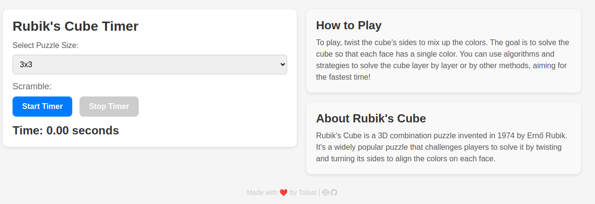

# Rubik's Cube Timer

A simple web-based timer for solving Rubik's Cube. The timer allows you to generate scrambles, time yourself, and even includes a solver feature.

## Features

- Generate random scrambles for various cube sizes.
- Start and stop the timer to measure solve times.
- Solve the cube using the built-in solver functionality.
- Responsive design for mobile and desktop.

## Getting Started

1. Clone this repository.
2. Open `index.html` in your web browser.

## Usage

1. Choose the puzzle size from the dropdown.
2. Click the "Start" button to generate a scramble and start the timer.
3. Click the "Stop" button to stop the timer and see your solve time.
4. Explore the "Solve" page for solving algorithms and visualizations.

## Contributing

Contributions are welcome! If you'd like to contribute to this project, please fork the repository and submit a pull request.

## License

This project is licensed under the [MIT License](LICENSE).
